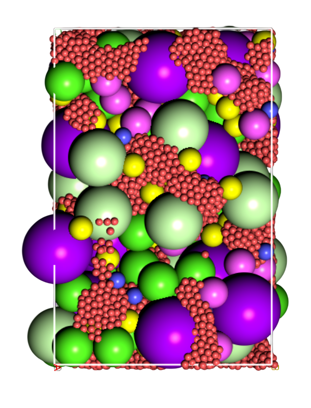
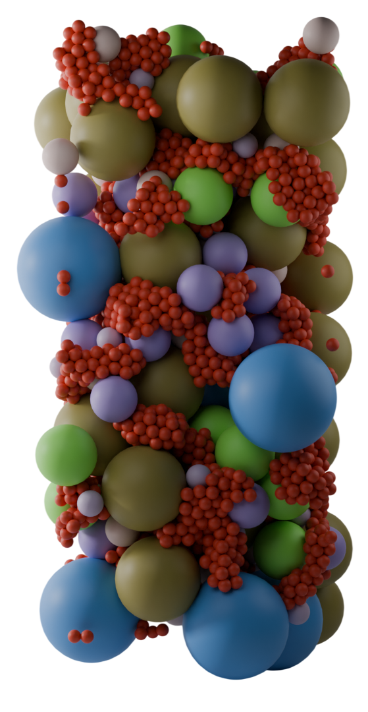
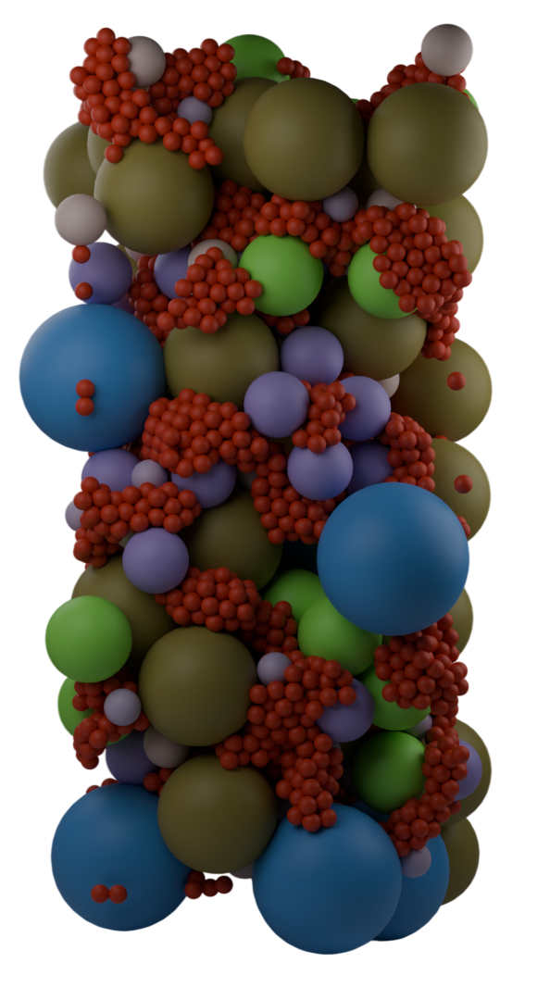

# LAMMPS Dump Importer for Blender

### Visualize Molecular Dynamics Simulations in Blender

[](https://www.blender.org/support/)
[](https://www.python.org/)
[](https://www.lammps.org/)
<!--  -->

Import **LAMMPS dump files** into **Blender** and visualize atoms as **spheres with per-atom radius**.

Designed for **molecular dynamics visualization, scientific rendering, and simulation exploration**.

---

# Overview

This Blender add-on reads **LAMMPS text dump files** and converts atom coordinates into **3D geometry inside Blender**.

Each atom becomes:

* a **UV sphere**
* scaled according to **radius**
* colored based on **atom type**

The importer also organizes atoms into **collections per atom type**, making it easy to manipulate large systems.

---

# Features

✔ Import LAMMPS dump files
✔ Supports **per-atom radius**
✔ Automatic **materials per atom type**
✔ Randomized color generation for atom types
✔ Automatic **collection grouping by atom type**
✔ Separate scaling controls for **coordinates** and **radii**
✔ Efficient sphere creation using a **prototype duplication method**

---

# Get your final images from boring to beautiful
Comparison between final outputs from legacy visulizers versus blender's cycles render engine. 
(Please note that both images are taken at differnt timesteps and are to show visual differences only)

<!-- <div style="display:flex;">
  
  
</div> -->

<!-- 

<p style="clear: both;"></p>
s -->

<!-- <div align="center">
<table style="border-collapse: collapse; margin: 20px auto;">
<tr>
<th style="padding: 10px;">Legacy Visualization</th>
<th style="padding: 10px;">Blender Visualization</th>
</tr>
<tr>
<td style="padding: 15px; text-align: center;">

</td>
<td style="padding: 15px; text-align: center;">

</td>
</tr>
<tr>
<td style="text-align: center;"><i>Typical final render output from using legacy visulizers like VMD</i></td>
<td style="text-align: center;"><i>Final render after importing the dump file in blender and using cycles</i></td>
</tr>
</table>
</div> -->

<div align="center">
<table style="border-collapse: collapse; margin: 20px auto;">
<tr>
<th style="padding: 10px;">Legacy Visualization</th>
<th style="padding: 10px;">Blender Visualization</th>
</tr>
<tr>
<td style="padding: 15px; text-align: center;">

</td>
<td style="padding: 15px; text-align: center;">

</td>
</tr>
<tr>
<td style="text-align: center;"><i>Typical final render output from using legacy visulizers like VMD</i></td>
<td style="text-align: center;"><i>Final render after importing the dump file in blender and using cycles</i></td>
</tr>
</table>
</div>


Recommended render settings:

* **Cycles renderer**
* HDRI environment lighting or use a three lighting setup
* Add level 2 subdiv surface modifier to all the particle after importing (if you have a good enough system)
<!-- * Depth of field camera -->

<!-- ---

# Workflow

# Example GIF Workflow

*(Add a short demo GIF here)*

```
README_images/import_demo.gif
```

I could add following to the workflow GIF:

1. Open Blender
2. File → Import → LAMMPS atoms
3. Select dump file
4. Atoms appear in viewport

--- -->

# Supported Dump Format 

Expected format:

```
ITEM: ATOMS id type x y z radius

Example:

ITEM: ATOMS id type x y z radius
1 1 0.15 0.32 0.71 0.5
2 2 0.44 0.21 0.12 0.6
3 1 0.12 0.85 0.33 0.5
```

Minimum required columns:

```
id type x y z

Optional column: radius
```

If `radius` is missing the importer uses a **default sphere radius**. Typically, .atom or .dump files have this format. .lammpstrj files have a different format, but I will add functionality to read them too into blender.

---

# Installation 
For now it is available as add-on, I will later put it on blender-extensions website which will make it easier to install.

## Method 1 — Install Add-on

1. Download the script `lammps_atoms_importer.py`

2. Open **Blender**

3. Navigate to `Edit → Preferences → Add-ons`


4. Go to the small down arrow, on the top right coner and click `Install from disk...`


5. Select the script file

6. Enable the add-on in the list of add-ons.

---

## Method 2 — Install from GitHub

Clone the repository:

```
git clone https://github.com/quarkKnight/BlenderToLAMMPS-master
```

Copy the file into Blender's addon folder: `Blender Foundation/<version>/scripts/addons_core/io_mesh_lammps`

If on windows, `OS:\Program Files\Blender Foundation\<version>\5.0\scripts\addons_core\io_mesh_lammps`

Restart Blender and enable the add-on.

---

# Usage

Import a LAMMPS dump file:

```
File → Import → LAMMPS Atoms (.lammpstrj, .dump)
```

Adjust import settings if needed and click **Import**. Atoms will appear as spheres in the current collection.

---

## Import Settings

### Coordinate Scale

Scales atom coordinates, (also scales atom radii)

LAMMPS units are often **Ångstroms**, while Blender uses **meters**.


`x_final = x_lammps × coordinate_scale`

Default: `8.0`

---

### Radius Scale

Independent scaling of atom radii.

`radius_final = radius × radius_scale × coordinate_scale`

Default: `1.0`

---

### Default Sphere Radius

Used if the dump file does not include a radius column.

Default: `0.1`

---

# Scene Organization

I have written the importer in such a way that it automatically organizes atoms into collections based on their type:

```
Scene Collection
 ├── Type_1
 │    ├── 1_1__12
 │    ├── 1_2__24
 │
 ├── Type_2
 │    ├── 2_1__3
 │    ├── 2_2__9
```

Object naming scheme: `{atomType}_{index}__{atomID}`

Example: `1_3__67`

Meaning:
* atom type = 1
* third atom of this type
* original LAMMPS atom ID = 67


## Materials

Each atom type receives a unique material.

Example materials: `Type_1` `Type_2` `Type_3`

 Colors are generated randomly for clear visual distinction. But can be easily changed in the materials tab of blender later on.


---

## Packaging the Add-on for sharing

To distribute the add-on properly:

### Folder Structure for now

```
BlenderToLAMMPS-master
├── __init__.py
├── README.md
└── LICENSE
```

Zip the folder: `BlenderToLAMMPS-master.zip`

You can install the ZIP directly through Blender's `Add-ons` → `Install From Disk..` menu.

---

# Limitations

Current version limitations:

* Only **single frame import**
* No **trajectory animation**
* No **bond visualization**
* Large systems may slow Blender due to object count

---

# Planned future features:

1. Trajectory Support :Import multiple timesteps and generate **Blender animation frames**.

2. Geometry Instancing: Use **instanced meshes** to support **millions of atoms** efficiently.
3. Atom Type Color Maps: To allow element based coloring, custom color palettes and periodic table mapping
4. Bond Detection: Optional bond generation using distance thresholds.
5. Performnace upgrade: Using GPU Instancing, geometry nodes or point cloud rendering to allow efficient rendering of very large MD simulations.
6. Presets: Advanced material presets and scientific rendering presets
6. Other formats: Support other files formats like xyz, gromacs and pdb

### Frame-by-frame Simulation Playback

Visualize LAMMPS trajectories directly in Blender.

---

# Contributing

Contributions are welcome.

<!-- ---

# License

MIT License

You are free to modify and distribute this project.

--- -->

# Author

**quarkKnight**

Inspired by 61rd's LAMMPS importer for Blender 2.67

Updated for **Blender 5.0**


## Example LAMMPS Dump Command

Example simulation output command:

```
dump 1 all custom 100 dump.lammpstrj id type x y z radius
```

This produces files compatible with the importer.


# Acknowledgments

* Blender Python API
* LAMMPS Molecular Dynamics Simulator
* Scientific visualization community

---
